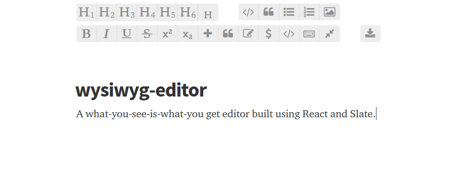

# wysiwyg-editor

A “what-you-see-is-what-you-get” editor built on [React][react] &
[Slate][slate].

## Demo

A running demonstration can be found [here][demo].

## Building

The project can be built using [webpack][webpack] by running `npm run build`
which will assemble the distribution under the `./dist` directory. This
directory can be cleaned by running `npm run clean`.

## Developing

The [webpack-dev-server][dev-server] is installed for development purposes and
can be run with the command `npm run dev`. This will start the development
server at [`http://localhost:8080`][localhost] and open it in your browser, with
[inline mode][inline] and [hot module replacement][hmr] enabled.

## License

This project is available under the terms of the ISC license. See the
[`LICENSE`][license] file for the copyright information and licensing terms.

## Features

- Smart typography utilizes [typographic ligatures][ligature] where appropriate
and provides intuitive shorthand replacements for common symbols and units.
- The floating rich editor menu allows for easy document edits to insert blocks
and toggle formatting.
- A persistent document state is saved to the browser’s local storage, allowing
document edits to continue across sessions. Once finished, the document may be
serialized and downloaded as a semantic HTML5 file.

### Quotes

Straight quotes surrounding a piece of text (e.g. 'single' or "double") are
substituted for their correct [curly quotation marks][quotes].

| Before        | After         |
|---------------|---------------|
| "Hello world" | “Hello world” |
| 'Hello world' | ‘Hello world’ |

### Hyphens

Hyphens that occur immediately after a numerical value are substituted for an
[endash][endash]. Hyphens delimited by spaces are substituted for an
[emdash][emdash], with the spaces being substituted for
[hair spaces][hairspace].

| Before | After |
|--------|-------|
| In the range of 10-20. | In the range of 10–20.  |
| Upon discovering the errors - all 124 of them - the publisher immediately recalled the books. | Upon discovering the errors — all 124 of them — the publisher immediately recalled the books. |

### Primes

Straight quotes that occur immediately after a numerical value are substituted
with [primes][primes].

| Before | After |
|--------|-------|
| He stood 6'1" tall. | He stood 6′1″ tall. |

### Punctuation

Three consecutive periods are substituted for an ellipsis.

| Before | After |
|--------|-------|
| A long time ago in a galaxy far, far away... | A long time ago in a galaxy far, far away… |

### Mathematics

When writing mathematical expressions the editor will substitute commonly used
symbols for their correct replacements. This includes replacing asterisks with
the multiplication symbol and consecutive forward slashes with the division
symbol, as well as supporting fractions, roman numerals, and the
[numero][numero] symbol.

| Before | After |
|:-------|:-----:|
| 5 * 5 // 5 = 5 | 5 × 5 ÷ 5 = 5 |
| 5 != 10 | 5 ≠ 10 |
| 5.1 ~~ 5 | 5.1 ≈ 5 |
| 1 // 1000 = 1%% | 1 ÷ 1000 = 1‰ |
| x >= y | x ≥ y |
| No.10 | №10 |
| 1 // 10 = 1/10 | 1 ÷ 10 = ⅒ |
| sqrt(4) = 2 | √4 = 2 |
| 360(deg) = 2(pi) rad | 360° = 2π rad |

### Roman Numerals

The editor can automatically replace decimal number inputs with the equivalent
in [roman numerals][roman].

| Before | After |
|:-------|:-----:|
| roman(2016) | ⅯⅯⅩⅤⅠ |
| roman(22) | ⅩⅩⅡ |
| roman(87) | ⅬⅩⅩⅩⅦ |
| roman(808) | ⅮⅭⅭⅭⅧ |

### Currency

Shorthands for currency characters are also available.

| Before | After |
|:------:|:-----:|
| (euro) | €     |
| (yen)  | ¥     |
| (cent) | ¢     |

### Symbols

Various symbols can be inserted with common shorthands, such as (c) for the ©
symbol.

| Before   | After |
|:--------:|:-----:|
| (c)      | ©     |
| (r)      | ®     |
| (tm)     | ™     |
| <--      | ←     |
| ..>      | ⇢     |
| <3       | ♡     |
| (check)  | ✓     |
| (cross)  | ✗     |
| (male)   | ♂     |
| (female) | ♀     |

### Keyboard Symbols

Symbol shorthands are also included for common symbols found on a keyboard.

| Before   | After |
|:--------:|:-----:|
| (enter)  | ↩     |
| (cmd)    | ⌘     |
| (alt)    | ⌥     |
| (tab)    | ⇥     |
| (undo)   | ↺     |
| (redo)   | ↻     |

[logo]: logo.png
[react]: https://facebook.github.io/react/
[ligature]: https://en.wikipedia.org/wiki/Typographic_ligature
[slate]: https://github.com/ianstormtaylor/slate
[demo]: https://mikebull94.github.io/wysiwyg-editor/
[webpack]: https://webpack.github.io/
[dev-server]: https://github.com/webpack/webpack-dev-server
[localhost]: http://localhost:8080
[inline]: https://webpack.github.io/docs/webpack-dev-server.html#inline-mode
[hmr]: https://webpack.github.io/docs/webpack-dev-server.html#hot-module-replacement
[license]: https://github.com/MikeBull94/wysiwyg-editor/blob/master/LICENSE
[endash]: http://www.thepunctuationguide.com/en-dash.html
[emdash]: http://www.thepunctuationguide.com/em-dash.html
[hairspace]: https://en.wikipedia.org/wiki/Whitespace_character#Hair_spaces_around_dashes
[quotes]: http://practicaltypography.com/straight-and-curly-quotes.html
[replacements]: https://github.com/MikeBull94/wysiwyg-editor/blob/master/lib/plugins/Plugins.jsx#L6
[primes]: https://mixcreative.wordpress.com/2010/01/30/apostrophe-or-prime/
[numero]: https://en.wikipedia.org/wiki/Numero_sign
[roman]: https://en.wikipedia.org/wiki/Roman_numerals
